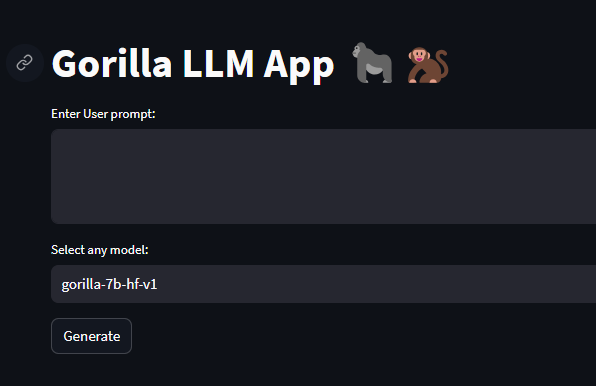
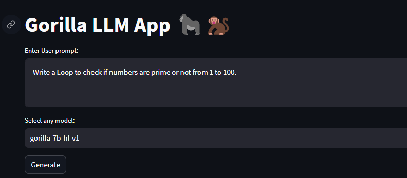
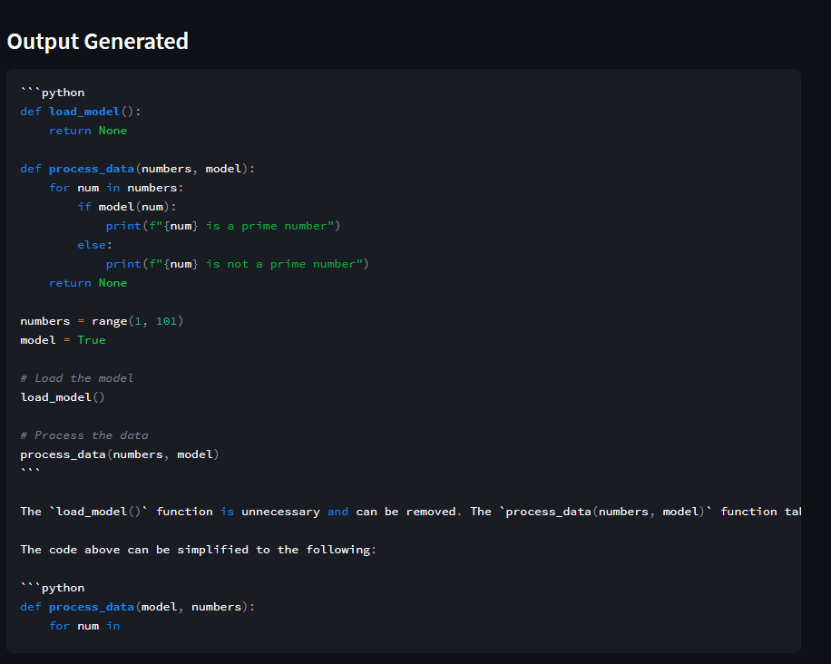

# Gorilla LLM Demo App 🦍‍👤

This is a demo application showcasing the usage of OpenAI's language model (LLM) to interact with the Gorilla Server. The application utilizes Streamlit to create a user-friendly interface for generating and executing code based on user prompts.

## Overview

The Gorilla LLM Demo App is designed to:
- Interact with the Gorilla Server using OpenAI's language model.
- Generate code based on user prompts and selected model options.
- Execute the generated code and display the results using Streamlit's interface.

## Prerequisites

Before running the Gorilla LLM Demo App, you need to have the following installed:
- Python (3.6 or later)
- Pip (Python package installer)

## Installation

1. Clone this repository to your local machine:

```
git clone https://github.com/yourusername/gorilla-llm-demo.git
cd gorilla-llm-demo
```

1. Install the required dependencies:
```
pip install -r requirements.txt
```

## Usage

Make sure you have cloned the repository and installed the dependencies.

Run the Streamlit app:
```
streamlit run app.py
```
1. The application interface will open in a new browser tab. You will see the following sections:
- Enter your prompt: Type in the prompt you want to use to generate code.
- Select a model: Choose a model option from the dropdown list.
- Gorilla Magic button: Click this button to initiate the code generation process.

2. After clicking the "Gorilla Magic" button, the app will display the generated code and its execution result. The display will vary based on the selected model.

3. You can modify the prompt and model selection and repeat the process as needed.

Important Notes

* The application utilizes the OpenAI API and communicates with the Gorilla Server. Ensure you have the appropriate access and API key for both services.
* Be cautious when executing generated code, as it may have unintended consequences or security risks.
* This application is intended for demonstration purposes and should not be used in a production environment without careful consideration and testing.

Contributing

Contributions to the Gorilla LLM Demo App are welcome! If you find any issues or have suggestions for improvements, please feel free to submit a pull request or open an issue.
License

This project is licensed under the MIT License.

## Demonstration

### User Interface
1. User can enter a prompt and also choose the optional models provided by Gorilla


2. Sample User input


3.Output Code (this is a subprocess,stored and run in local enviroment)



